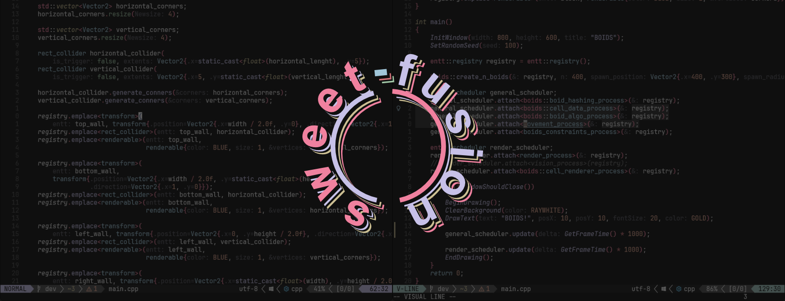
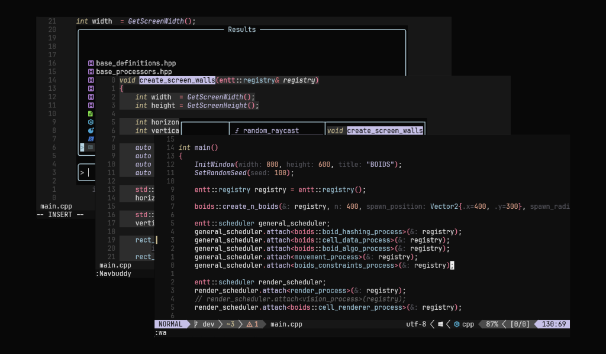
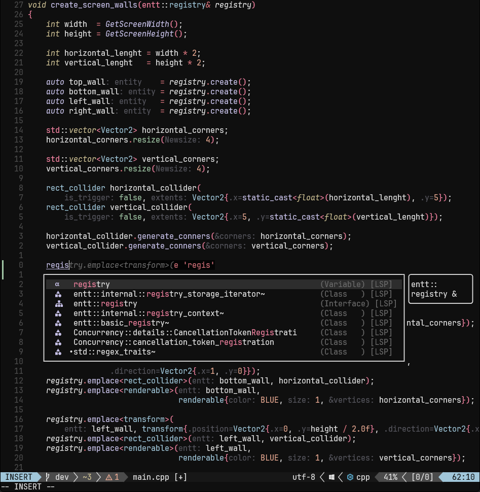
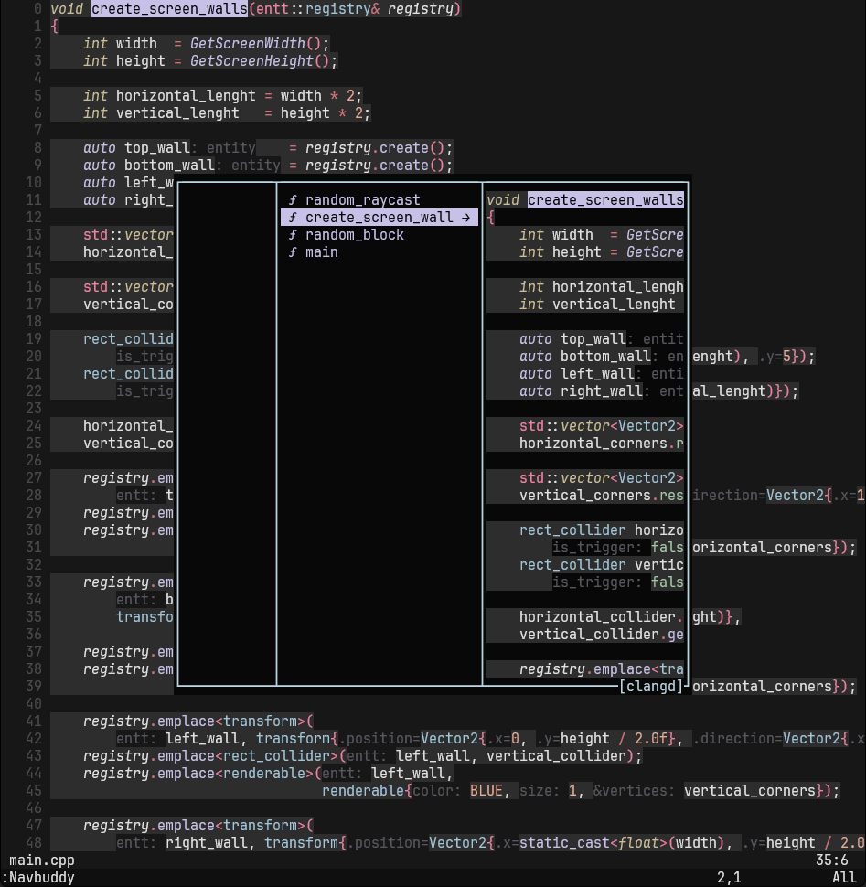
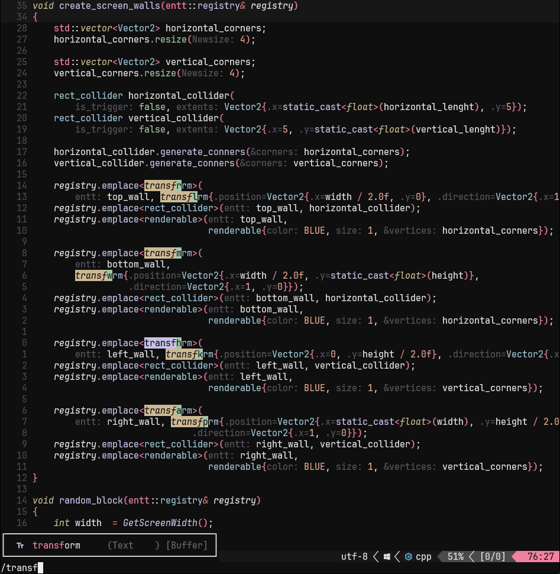
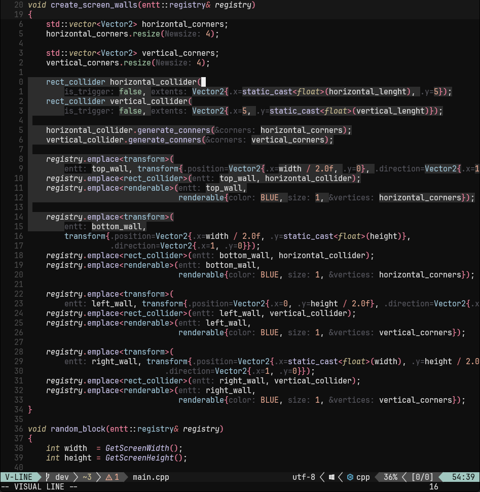
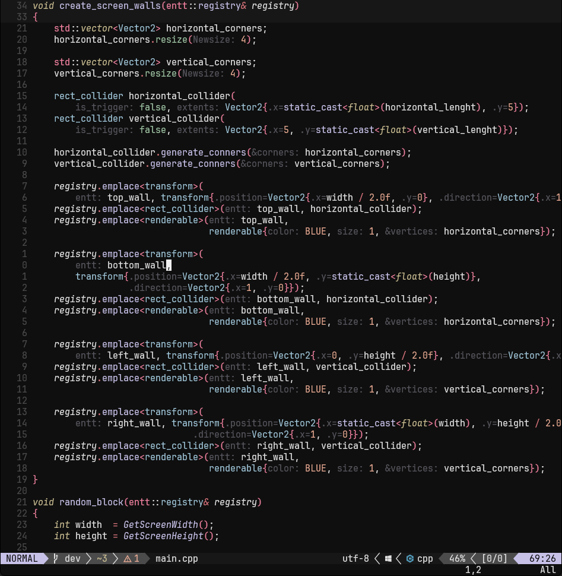
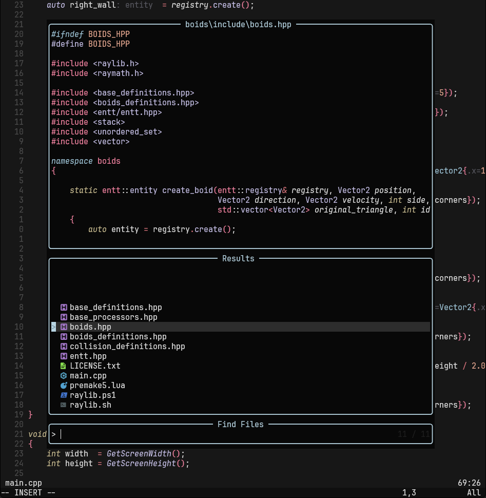

# sweet-fusion
This is a very **WIP** neovim colorscheme.



## Screenshots





<!--  -->
<!--  -->
<!--  -->
<!--  -->
<!--  -->


## Features
- Treesitter support.
- Support to some plugins, mainly ones I have used, I'd tried to add more in the future.

## Installation

### lazy.nvim
```lua
{
    'DanielEliasib/sweet-fusion',
	name = 'sweet-fusion',
	priority = 1000,
	opts = {
			-- Set transparent background
		transparency = false,
		dim_inactive = true,
	}
}

```

## Options
The options that are currently supported are the following:
```lua
{
	terminal_colors = true,
	transparency = true,
	hl_styles = {
		comments = { italic = true },
		keywords = { italic = true },
		functions = { },
		variables = { }
	},
	dim_inactive = true,
}

```

## Current plugin support
- [lualine.nvim](https://github.com/nvim-lualine/lualine.nvim)
- [nvim-treesitter-context](https://github.com/nvim-treesitter/nvim-treesitter-context)
- [aerial.nvim](https://github.com/stevearc/aerial.nvim)
- [nvim-cmp](https://github.com/hrsh7th/nvim-cmp)
- [dashboard-nvim](https://github.com/nvimdev/dashboard-nvim)
- [gitsigns.nvim](https://github.com/lewis6991/gitsigns.nvim)
- [nvim-navic](https://github.com/SmiteshP/nvim-navic)
- [nvim-navbuddy](https://github.com/SmiteshP/nvim-navbuddy)
- [nvim-tree.lua](https://github.com/nvim-tree/nvim-tree.lua)
- [telescope.nvim](https://github.com/nvim-telescope/telescope.nvim)
- [todo-comments.nvim](https://github.com/folke/todo-comments.nvim)
- [which-key](https://github.com/folke/which-key.nvim)
- [nvim-dap-ui](https://github.com/rcarriga/nvim-dap-ui)
- [vim-illuminate](https://github.com/RRethy/vim-illuminate)
- [nvim-lightbulb](https://github.com/kosayoda/nvim-lightbulb)
- [modes.nvim](https://github.com/mvllow/modes.nvim)

## Notes

- Highlight groups, and main code structure, taken from [tokyonight.nvim](https://github.com/folke/tokyonight.nvim) and [monokai-nightasty](https://github.com/polirritmico/monokai-nightasty.nvim)
- For modes.nvim, if you are using Lazy, you need to load it on VimEnter or it will override the themes highlight groups.
